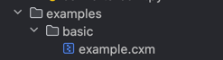

# ContextMachine Data Format
[](https://github.com/contextmachine/cxmdata/actions/workflows/docker-publish.yml)
## Prequest
The main package is `cxmdata`. All other packages in the directory exist to use the format within third-party packages.
## Description
СxmData allows you to combine data from different sources and create custom data decoders/encoders. 
You just pass the dependencies and decode what you want into simple python dictionaries or json.
## Installation
### Pip
If you want to install with `pip`. You can follow:
```bash
pip install git+https://github.com/contextmachine/cxmdata.git
```
### Docker
Pull image: 
```bash
docker sthv/cxmdata:latest

``` 
Or build from `Dockerfile`:
```bash
cd cxmdata
docker build . -t <tagname>
```
## Example of usage:
 In this case, we make an array with `RhinoCommon` objects in RhinoPython. We can decode it with a `rhino3dm` library.
    However, we need a more complex data structure and custom attributes.
```python
from cxmdata import CxmData


with open("examples/basic/example.cxm","r") as d:
    cxm=CxmData(d.read())
```
Result:
```doctest
>>> cxm.decompress()
({'values': [<rhino3dm._rhino3dm.PolyCurve at 0x14cd440f0>, 'P-L-1-5-1'],
 'keys': ['k1', 'k2']},
{'values': [<rhino3dm._rhino3dm.PolyCurve at 0x14cd441f0>, 'P-L-1-5-2'],
 'keys': ['k1', 'k2']},

...
 ```
CxmData is a string converted to ASCII using [Base64](https://en.wikipedia.org/wiki/Base64). 
Therefore it can be safely passed to any api and will also make it easier for you to use your service from another api

### Patterns
The format is designed for transferring data over the network using http, ws, and sockets. There is therefore no particular need for a file representation.
However, if data storage in the file system is crucial, the file can be saved as a bz, gzip archive with extensions:
```
*.cxm *.cxz 
```
For example, with using Pycharm:\

## Using insude [rhinocode](https://discourse.mcneel.com/t/rhino-8-feature-rhinocode-cpython-csharp/128353)

### Start using inside with pip
To start using: 
```bash
# use your default shell
$HOME/.rhinocode/<path to python>/<python> -m pip install git+https://github.com/contextmachine/cxmdata.git
```
Your `<path to python>` and `<python>` may be different depending on runtime or python version. For example it might be: 
```bash
$HOME/.rhinocode/python3.9-1.26/python3.9
```
### Start using inside with internal import
You can also simply import the package directly into Python scripts. To do this, clone the repository to a convenient location `<path to repo>` and place the following in the python script:
```python
import sys


sys.path.append(<path to repo>)
from cxmdata import CxmData

# you python code

```
